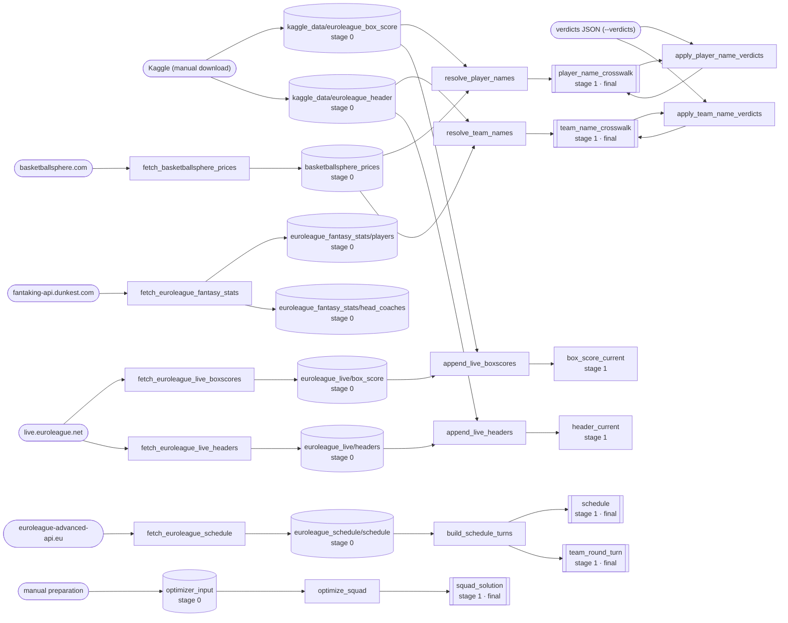

<!-- GENERATED — do not edit. Regenerated from the Inputs/Outputs/Final header of every script in src/eupy/. -->

# Data graph

> **GENERATED — do not edit.** Lineage derived from script I/O headers. Rounded = external sources, rectangles = scripts, cylinders = raw datasets (`stage 0`), double-bordered = produced datasets with `final: true` (exposed under `data/stage_99/` as relative symlinks). Inventory: [data-catalogue.md](data-catalogue.md).

