<!-- GENERATED — do not edit. Regenerate with `uv run python -m eupy.registry graph`. -->

# Data graph

> **GENERATED — do not edit.** Generated by `python -m eupy.registry graph` from the script I/O headers (plus `src/eupy/registry/raw_sources.toml`). Shapes: stadium = external source, rectangle = script, cylinder = dataset (raw or produced). Colors: one hue per stage (datasets take their stage hue; scripts are neutral with a stroke in the hue of their highest output stage; external sources are gray). Boxes group scripts by pipeline (`pipelines.toml`). `★` + thick border = `final` dataset (exposed under `data/stage_99/`). Inventory: [data-catalogue.md](data-catalogue.md).

```mermaid
flowchart LR
    %% external sources
    x_JSON_verdicts_file____verdicts_PATH_(["JSON verdicts file (--verdicts PATH)"])
    x_Kaggle__manual_download_(["Kaggle (manual download)"])
    x_fantaking_api_dunkest_com__live__auth_via_EUROLEAGUE_FANTASY_AUTH_TOKEN_env_var_or_repo_root__env_(["fantaking-api.dunkest.com (live; auth via EUROLEAGUE_FANTASY_AUTH_TOKEN env var or repo-root .env)"])
    x_https___basketballsphere_com_en_euroleague_fantasy_player_prices___live_(["https://basketballsphere.com/en/euroleague-fantasy-player-prices/ (live)"])
    x_https___euroleague_advanced_api_eu_Euroleague_schedule_season__year___live_(["https://euroleague-advanced-api.eu/Euroleague/schedule?season={year} (live)"])
    x_live_euroleague_net_api_Header__live_(["live.euroleague.net/api/Header (live)"])
    x_live_euroleague_net_api_Header_and_live_euroleague_net_api_BoxScore__live_(["live.euroleague.net/api/Header and live.euroleague.net/api/BoxScore (live)"])
    x_prepared_manually__upstream_feature_prediction_script_not_built_yet_(["prepared manually (upstream feature/prediction script not built yet)"])

    %% scripts
    subgraph p_acquire["acquire"]
        s_fetch_basketballsphere_prices["fetch_basketballsphere_prices"]
        s_fetch_euroleague_fantasy_stats["fetch_euroleague_fantasy_stats"]
    end
    subgraph p_entity["entity"]
        s_apply_fantasy_stats_player_name_verdicts["apply_fantasy_stats_player_name_verdicts"]
        s_apply_player_name_verdicts["apply_player_name_verdicts"]
        s_apply_team_name_verdicts["apply_team_name_verdicts"]
        s_normalize_fantasy_stats["normalize_fantasy_stats"]
        s_resolve_fantasy_stats_player_names["resolve_fantasy_stats_player_names"]
        s_resolve_player_names["resolve_player_names"]
        s_resolve_team_names["resolve_team_names"]
    end
    subgraph p_net["net"]
        s_append_live_boxscores["append_live_boxscores"]
        s_append_live_headers["append_live_headers"]
        s_fetch_euroleague_live_boxscores["fetch_euroleague_live_boxscores"]
        s_fetch_euroleague_live_headers["fetch_euroleague_live_headers"]
    end
    subgraph p_optimize["optimize"]
        s_optimize_squad["optimize_squad"]
    end
    subgraph p_schedule["schedule"]
        s_build_schedule_turns["build_schedule_turns"]
        s_fetch_game_schedule["fetch_game_schedule"]
    end

    %% datasets
    d_basketballsphere_prices[("basketballsphere_prices<br/>(stage 0)")]
    d_euroleague_net_box_score[("euroleague_net/box_score<br/>(stage 0)")]
    d_euroleague_net_headers[("euroleague_net/headers<br/>(stage 0)")]
    d_fantasy_stats_head_coaches[("fantasy_stats/head_coaches<br/>(stage 0)")]
    d_fantasy_stats_players[("fantasy_stats/players<br/>(stage 0)")]
    d_fantasy_stats_player_name_verdicts[("fantasy_stats_player_name_verdicts<br/>(stage 0)")]
    d_game_schedule_schedule[("game_schedule/schedule<br/>(stage 0)")]
    d_kaggle_data_euroleague_box_score[("kaggle_data/euroleague_box_score<br/>(stage 0)")]
    d_kaggle_data_euroleague_header[("kaggle_data/euroleague_header<br/>(stage 0)")]
    d_optimizer_input[("optimizer_input<br/>(stage 0)")]
    d_player_name_verdicts[("player_name_verdicts<br/>(stage 0)")]
    d_team_name_verdicts[("team_name_verdicts<br/>(stage 0)")]
    d_box_score_current[("box_score_current<br/>(stage 1)")]
    d_fantasy_stats_player_name_crosswalk[("fantasy_stats_player_name_crosswalk ★<br/>(stage 1)")]
    d_header_current[("header_current<br/>(stage 1)")]
    d_player_name_crosswalk[("player_name_crosswalk ★<br/>(stage 1)")]
    d_schedule[("schedule ★<br/>(stage 1)")]
    d_squad_solution[("squad_solution ★<br/>(stage 1)")]
    d_team_name_crosswalk[("team_name_crosswalk ★<br/>(stage 1)")]
    d_team_round_turn[("team_round_turn ★<br/>(stage 1)")]
    d_fantasy_stats_players_normalized[("fantasy_stats_players_normalized ★<br/>(stage 2)")]

    %% edges
    d_basketballsphere_prices --> s_resolve_fantasy_stats_player_names
    d_basketballsphere_prices --> s_resolve_player_names
    d_basketballsphere_prices --> s_resolve_team_names
    d_euroleague_net_box_score --> s_append_live_boxscores
    d_euroleague_net_headers --> s_append_live_headers
    d_fantasy_stats_player_name_crosswalk --> s_normalize_fantasy_stats
    d_fantasy_stats_player_name_verdicts --> s_resolve_fantasy_stats_player_names
    d_fantasy_stats_players --> s_normalize_fantasy_stats
    d_fantasy_stats_players --> s_resolve_fantasy_stats_player_names
    d_game_schedule_schedule --> s_build_schedule_turns
    d_kaggle_data_euroleague_box_score --> s_append_live_boxscores
    d_kaggle_data_euroleague_box_score --> s_resolve_fantasy_stats_player_names
    d_kaggle_data_euroleague_box_score --> s_resolve_player_names
    d_kaggle_data_euroleague_header --> s_append_live_headers
    d_kaggle_data_euroleague_header --> s_resolve_team_names
    d_optimizer_input --> s_optimize_squad
    d_player_name_verdicts --> s_resolve_player_names
    d_team_name_verdicts --> s_resolve_team_names
    s_append_live_boxscores --> d_box_score_current
    s_append_live_headers --> d_header_current
    s_apply_fantasy_stats_player_name_verdicts --> d_fantasy_stats_player_name_verdicts
    s_apply_player_name_verdicts --> d_player_name_verdicts
    s_apply_team_name_verdicts --> d_team_name_verdicts
    s_build_schedule_turns --> d_schedule
    s_build_schedule_turns --> d_team_round_turn
    s_fetch_basketballsphere_prices --> d_basketballsphere_prices
    s_fetch_euroleague_fantasy_stats --> d_fantasy_stats_head_coaches
    s_fetch_euroleague_fantasy_stats --> d_fantasy_stats_players
    s_fetch_euroleague_live_boxscores --> d_euroleague_net_box_score
    s_fetch_euroleague_live_headers --> d_euroleague_net_headers
    s_fetch_game_schedule --> d_game_schedule_schedule
    s_normalize_fantasy_stats --> d_fantasy_stats_players_normalized
    s_optimize_squad --> d_squad_solution
    s_resolve_fantasy_stats_player_names --> d_fantasy_stats_player_name_crosswalk
    s_resolve_player_names --> d_player_name_crosswalk
    s_resolve_team_names --> d_team_name_crosswalk
    x_JSON_verdicts_file____verdicts_PATH_ --> s_apply_fantasy_stats_player_name_verdicts
    x_JSON_verdicts_file____verdicts_PATH_ --> s_apply_player_name_verdicts
    x_JSON_verdicts_file____verdicts_PATH_ --> s_apply_team_name_verdicts
    x_Kaggle__manual_download_ --> d_kaggle_data_euroleague_box_score
    x_Kaggle__manual_download_ --> d_kaggle_data_euroleague_header
    x_fantaking_api_dunkest_com__live__auth_via_EUROLEAGUE_FANTASY_AUTH_TOKEN_env_var_or_repo_root__env_ --> s_fetch_euroleague_fantasy_stats
    x_https___basketballsphere_com_en_euroleague_fantasy_player_prices___live_ --> s_fetch_basketballsphere_prices
    x_https___euroleague_advanced_api_eu_Euroleague_schedule_season__year___live_ --> s_fetch_game_schedule
    x_live_euroleague_net_api_Header__live_ --> s_fetch_euroleague_live_headers
    x_live_euroleague_net_api_Header_and_live_euroleague_net_api_BoxScore__live_ --> s_fetch_euroleague_live_boxscores
    x_prepared_manually__upstream_feature_prediction_script_not_built_yet_ --> d_optimizer_input

    %% colors by stage
    classDef script_stage0 fill:#f7f7f7,stroke:#c97f3a,color:#222222
    classDef script_stage1 fill:#f7f7f7,stroke:#5a9c5a,color:#222222
    classDef script_stage2 fill:#f7f7f7,stroke:#5b84a3,color:#222222
    classDef source fill:#e8e8e8,stroke:#888888,color:#333333
    classDef stage0 fill:#fde9d9,stroke:#c97f3a,color:#4a2c0a
    classDef stage1 fill:#dcecdc,stroke:#5a9c5a,color:#1e3a1e
    classDef stage1_final fill:#dcecdc,stroke:#5a9c5a,color:#1e3a1e,stroke-width:4px
    classDef stage2_final fill:#dbe9f6,stroke:#5b84a3,color:#1a2b3c,stroke-width:4px
    class s_apply_fantasy_stats_player_name_verdicts,s_apply_player_name_verdicts,s_apply_team_name_verdicts,s_fetch_basketballsphere_prices,s_fetch_euroleague_fantasy_stats,s_fetch_euroleague_live_boxscores,s_fetch_euroleague_live_headers,s_fetch_game_schedule script_stage0
    class s_append_live_boxscores,s_append_live_headers,s_build_schedule_turns,s_optimize_squad,s_resolve_fantasy_stats_player_names,s_resolve_player_names,s_resolve_team_names script_stage1
    class s_normalize_fantasy_stats script_stage2
    class x_JSON_verdicts_file____verdicts_PATH_,x_Kaggle__manual_download_,x_fantaking_api_dunkest_com__live__auth_via_EUROLEAGUE_FANTASY_AUTH_TOKEN_env_var_or_repo_root__env_,x_https___basketballsphere_com_en_euroleague_fantasy_player_prices___live_,x_https___euroleague_advanced_api_eu_Euroleague_schedule_season__year___live_,x_live_euroleague_net_api_Header__live_,x_live_euroleague_net_api_Header_and_live_euroleague_net_api_BoxScore__live_,x_prepared_manually__upstream_feature_prediction_script_not_built_yet_ source
    class d_basketballsphere_prices,d_euroleague_net_box_score,d_euroleague_net_headers,d_fantasy_stats_head_coaches,d_fantasy_stats_player_name_verdicts,d_fantasy_stats_players,d_game_schedule_schedule,d_kaggle_data_euroleague_box_score,d_kaggle_data_euroleague_header,d_optimizer_input,d_player_name_verdicts,d_team_name_verdicts stage0
    class d_box_score_current,d_header_current stage1
    class d_fantasy_stats_player_name_crosswalk,d_player_name_crosswalk,d_schedule,d_squad_solution,d_team_name_crosswalk,d_team_round_turn stage1_final
    class d_fantasy_stats_players_normalized stage2_final
```

